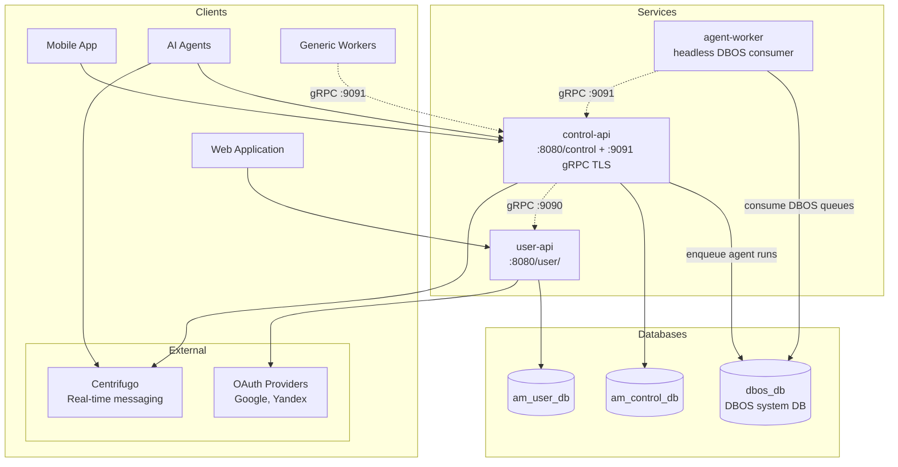

# Architecture

## System Overview

## Services

### user-api
Authentication service handling OAuth2 login (Google, Yandex), JWT token management, user profiles, and API key management. Exposes gRPC IntrospectApiKey endpoint for API key validation by other services.

### control-api
Control API for device registration, tool delivery, trigger submission, and AI agent integration. Integrates with Centrifugo for real-time push to devices and agents. Agents authenticate via API Key, invoke tools on devices, receive tool results and trigger events through Centrifugo channels.

### agent-worker
Headless (non-web) Spring Boot worker running the AI-agent loop: consumes agent runs from DBOS queues (Postgres-backed, enqueued by control-api), drives an LLM turn loop (Spring AI) with backend tools, and talks to control-api over gRPC :9091 (worker-pool Bearer auth). Shares the DBOS system database with control-api. See [services/agent-worker.md](services/agent-worker.md).

### libs/common
Shared library containing exception hierarchy, REST response wrappers (`SuccessResponse`, `ErrorResponse`), JWT/API Key utilities, and `UUIDUtils` (UUIDv8 generation).

### libs/agentworker-proto
Shared worker-protocol contract: gRPC/protobuf stubs generated from `agentworker/*.proto` plus `WorkerProtocol` (the DBOS queue/workflow contract names and the router workflow-id scheme), compiled into both control-api and agent-worker.

## Authentication Flows

| Method               | Description                                                  | Used By                             |
|----------------------|--------------------------------------------------------------|-------------------------------------|
| **JWT**              | Bearer token authentication for users                        | All services (management endpoints) |
| **API Key**          | Header `X-Api-Key` for agent calls                           | control-api                          |
| **Application Auth** | Header `X-App-Auth-Key` for application/devices              | control-api                          |
| **Worker Pool Key**  | gRPC `authorization: Bearer wrkp...`, hash stored in config  | control-api gRPC `:9091`             |
| **OAuth2**           | Google/Yandex social login                                   | user-api                            |

### JWT Flow
- Access tokens returned in response body
- Refresh tokens stored in HTTP-only cookies
- Algorithm: ES256 (ECDSA with P-256 curve)

## Databases

| Database         | Owner          | Tables                                                                      |
|------------------|----------------|-----------------------------------------------------------------------------|
| am_user_db       | user-api       | `users`, `user_oauth_accounts`, `service_api_keys`, `waitlist_entries`      |
| am_control_db     | control-api     | `connectors`, `trigger_logs`, `trigger_log_agents`, `tool_call_logs`, `agents`, `agent_tools`, `agent_triggers`, `webhook_delivery_logs`, `platforms`, `integrations`, `agentic_teams` |

All migrations managed via Liquibase in each service's `src/main/resources/db/changelog/`.

## Inter-Service Communication

### gRPC (control-api → user-api)
- Port: **9090**
- control-api acts as gRPC client
- user-api acts as gRPC server
- Used for API key introspection (IntrospectApiKey)

## Ports

| Port | Purpose                                    |
|------|--------------------------------------------|
| 8080 | HTTP (all services)                        |
| 8088 | Management/actuator (all services)         |
| 9090 | gRPC (user-api server)                     |
