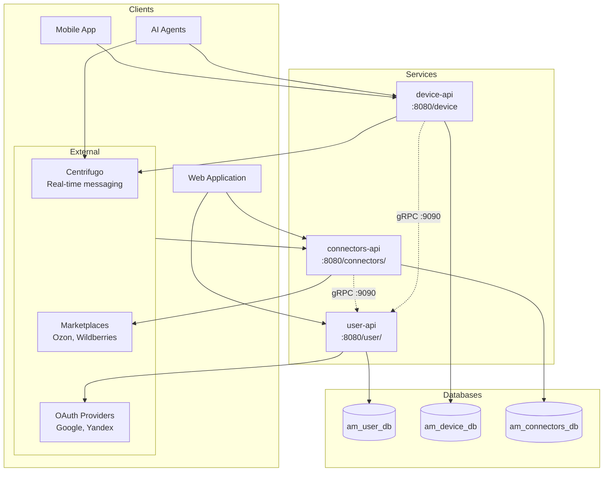

# Architecture

## System Overview

## Services

### user-api
Authentication service handling OAuth2 login (Google, Yandex), JWT token management, user profiles, and API key management. Exposes gRPC IntrospectApiKey endpoint for API key validation by other services.

### device-api
Device API for device registration, tool delivery, trigger submission, and AI agent integration. Integrates with Centrifugo for real-time push to devices and agents. Agents authenticate via API Key, invoke tools on devices, receive tool results and trigger events through Centrifugo channels.

### connectors-api
External integrations service managing connector definitions, encrypted credentials storage, and marketplace API calls. Communicates with user-api via gRPC for API key introspection (with Caffeine cache, TTL 2 min).

### libs/common
Shared library containing exception hierarchy, REST response wrappers (`SuccessResponse`, `ErrorResponse`), JWT/API Key utilities, and `UUIDUtils` (UUIDv8 generation).

## Authentication Flows

| Method          | Description                            | Used By                             |
|-----------------|----------------------------------------|-------------------------------------|
| **JWT**         | Bearer token authentication for users  | All services (management endpoints) |
| **API Key**     | Header `X-Api-Key` for connector/agent calls | connectors-api, device-api          |
| **App Auth**    | Header `X-App-Auth-Key` for apps       | device-api                          |
| **OAuth2**      | Google/Yandex social login             | user-api                            |

### JWT Flow
- Access tokens returned in response body
- Refresh tokens stored in HTTP-only cookies
- Algorithm: ES256 (ECDSA with P-256 curve)

## Databases

| Database         | Owner          | Tables                                                                      |
|------------------|----------------|-----------------------------------------------------------------------------|
| am_user_db       | user-api       | `users`, `user_oauth_accounts`, `service_api_keys`                          |
| am_device_db     | device-api     | `apps`, `trigger_logs`, `trigger_log_agents`, `tool_use_logs`, `agent_settings`, `agent_tools`, `agent_triggers`, `webhook_delivery_logs` |
| am_connectors_db | connectors-api | `connectors`, `credentials`, `webhooks`, `webhook_events`, `webhook_logs`, `event_descriptions` |

All migrations managed via Liquibase in each service's `src/main/resources/db/changelog/`.

### Migration Best Practices
- Prefer `TEXT` over `VARCHAR(n)` for string columns
- Entity `@Column` definitions should match: use `columnDefinition = "TEXT"`
- Use specific types (`UUID`, `TIMESTAMP`, `BOOLEAN`, `INTEGER`, `BIGINT`) where appropriate

## Inter-Service Communication

### gRPC (connectors-api → user-api)
- Port: **9090**
- connectors-api acts as gRPC client
- user-api acts as gRPC server
- Used for API key introspection (IntrospectApiKey)
- Caffeine cache on client side (TTL 2 min, max 10k entries)

### gRPC (device-api → user-api)
- Port: **9090**
- device-api acts as gRPC client
- user-api acts as gRPC server
- Used for API key introspection (IntrospectApiKey)

## Ports

| Port | Purpose                                    |
|------|--------------------------------------------|
| 8080 | HTTP (all services)                        |
| 8088 | Management/actuator (all services)         |
| 9090 | gRPC (user-api server)                     |
