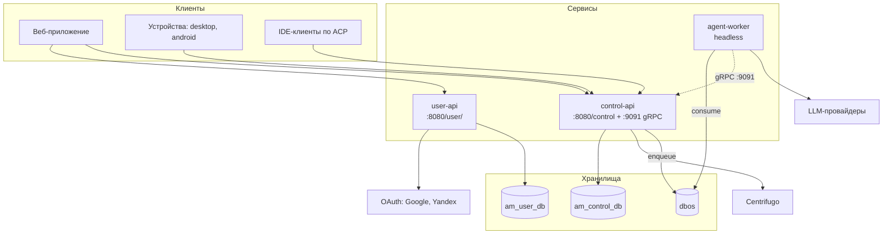

# Обзор архитектуры

Три сервиса и две общие библиотеки. Разделение проходит по тому, **кто чем владеет**: user-api
владеет личностью пользователя, control-api — всей предметной областью и политикой, agent-worker
не владеет ничем и потому масштабируется горизонтально.

## Сервисы

**user-api** — вход в систему: OAuth2 (Google, Yandex), выпуск и обновление JWT, профили. Про
агентов не знает ничего.

**control-api** — предметная область целиком: агенты, скиллы, коннекторы, подключения, каналы,
триггеры, доски, LLM-провайдеры и квоты. Здесь же живёт **вся политика доступа** (ABAC) и сборка
контекста рана. Обслуживает три разных клиентских контура (дашборд, устройства, агенты),
gRPC-протокол воркеров на `:9091` и ACP-эндпоинт для IDE.

**agent-worker** — headless-потребитель очереди DBOS: берёт ран, тянет весь контекст одним вызовом,
крутит цикл с моделью, вызывает тулы через бэкенд и пишет историю. Доступа к базе control-api не
имеет и знает про ран только `{agent_id, run_id}`.

**libs/common** — иерархия исключений, обёртки ответов (`SuccessResponse`/`ErrorResponse`), JWT и
`UUIDUtils`. **libs/agentworker-proto** — protobuf-контракт воркера, компилируется в оба сервиса,
чтобы стороны не могли разъехаться.

## Почему воркер — отдельный процесс

Агентский ран — это минуты ожидания модели и тулов, а не миллисекунды. Держать его в HTTP-запросе
нельзя, а держать в потоке control-api — значит связать масштабирование API с нагрузкой на LLM.
Поэтому ран оформлен как durable workflow в DBOS: control-api кладёт его в очередь и забывает,
воркер берёт и исполняет, падение воркера означает переигрывание, а не потерю.

Отсюда же следует, что **очередь партиционирована по сессии**: в рамках сессии писатель истории
должен быть один, и это обеспечивается транспортом, а не блокировками в коде.

## Хранилища

| База | Владелец | Что внутри |
|---|---|---|
| `am_user_db` | user-api | `users`, `user_oauth_accounts`, `waitlist_entries` |
| `am_control_db` | control-api | Вся предметная область — [состав по областям](../services/control-api.md) |
| `dbos` | DBOS | Системная база очередей и чекпоинтов. **Общая** для control-api (producer) и agent-worker (consumer): если они смотрят в разные, у очереди просто нет потребителя |

Миграции — Liquibase, в каждом сервисе свой `src/main/resources/db/changelog/`.

## Аутентификация

Четыре независимых контура, у каждого своя цепочка фильтров:

| Контур | Как | Кто ходит |
|---|---|---|
| JWT | `Authorization: Bearer <jwt>` | Пользователь в дашборде (`/manage/**`) |
| Ключ агента | `X-Api-Key` | Агент (`/agent/**`), ACP-клиент |
| Ключ приложения | `X-App-Auth-Key` | Устройство (`/app/**`) |
| Ключ пула воркеров | gRPC `authorization: Bearer wrkp…` | agent-worker (`:9091`) |

JWT подписывается ES256; access-токен уходит в теле ответа, refresh — в HttpOnly-куке. Формат трёх
последних ключей общий, см. [contracts/api-keys.md](../contracts/api-keys.md).

## Реальное время

Centrifugo доставляет push устройствам и агентам. Токены подключения и подписки выпускает
control-api и подписывает **собственной** ES256-парой (`CENTRIFUGO_PRIVATEKEY`), независимой от
пользовательской. См. [contracts/centrifugo-channels.md](../contracts/centrifugo-channels.md).

## Порты

| Порт | Назначение |
|---|---|
| 8080 | HTTP (оба веб-сервиса; при одновременном локальном запуске control-api переносят на 8180) |
| 8088 | Management/actuator |
| 9091 | gRPC control-api для воркеров |
| 9000 | Centrifugo в локальном стенде |
