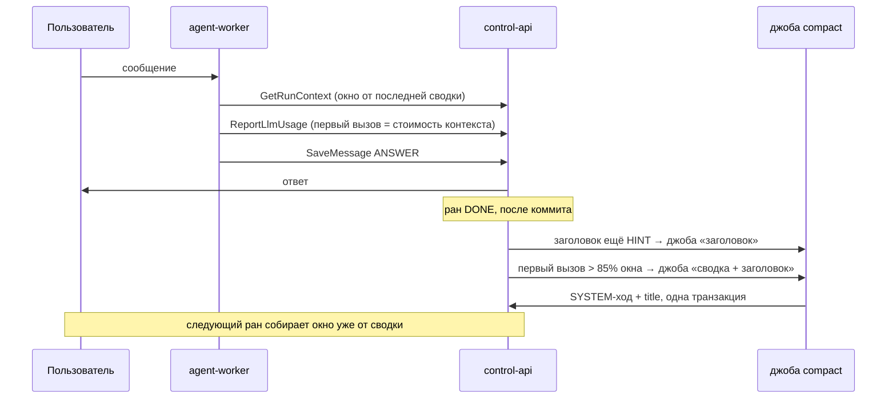

# Компакция окна истории

Длинный разговор упирается в окно контекста модели. Сейчас окно истории режется по числу ранов
(`effective.historyLimit()`) и по `MAX_HISTORY_TURNS = 300` ходов: старые раны просто выпадают, и
агент забывает начало разговора. Компакция заменяет выпавшее сводкой: ранние раны сессии
пересказываются, пересказ встаёт в начало окна, последние раны остаются дословными.

Здесь описана механика — где лежит сводка, как строится окно, кто и когда её считает. Кто её включает
и что ещё умеет коннектор — в [agent-sessions-connector.md](agent-sessions-connector.md).

## Главное

- **Сводка — это SYSTEM-ход журнала ходов.** Строка `agent_run_turns` с `role = SYSTEM` и
  `turn_index = -1` у первого рана, который остаётся дословным. Новой таблицы, enum-значения и
  колонки нет: роль `SYSTEM` уже есть в enum и в `chk_agent_run_turns_role`, но в журнал до сих пор не
  писалась.
- **Решает система, а не модель.** Порог считает control-api по токенам первого вызова модели в
  ране; модель про компакцию не знает и хода на неё не тратит. Подсказки «пора сжать» в промпте нет.
- **Считает control-api, а не агент.** Один вызов модели с назначением `ROUTINE` из джобы
  коннектора `sessions` — тем же путём, каким media описывает картинку. Агентного рана нет, партиция
  сессии не занимается, пользователь компакцию не ждёт.
- **Та же джоба ставит заголовок.** Сводка и заголовок приходят одним ответом модели и пишутся
  одной транзакцией. Заголовок нового диалога — та же джоба без сводки.
- **Только диалоги с человеком.** Триггерные сессии и сессии субагентов не сжимаются.

## Когда

Обе причины проверяются в одной точке — когда ран сессии переходит в `DONE`
(`MessageLogPersistence`, финальный ANSWER), после коммита. Проверка не держит ответ пользователю,
работа уходит строкой `connector_jobs`.

**Порог — по первому вызову модели в ране.** Его `input_tokens` в `llm_usage_log` — ровно стоимость
собранного контекста: системный промпт, окно истории, сообщение. Последний вызов раздут выводами тулов
этого рана, а в историю они попадут урезанными до `TOOL_JSON_CONTEXT_CAP = 4 КБ` — он завышал бы
оценку. Первый вызов находится через журнал ходов: первый ASSISTANT-ход рана несёт `call_id`
вызова, который его произвёл, — так вызовы media внутри рана не путаются с вызовами цикла. Окно —
`context_window` модели, которой ран отвечал (`llm_provider_models`, фолбэк `llm_model_defaults`);
окно неизвестно — компакции нет. Сводка, написанная после старта рана, его уже учла — повторно рана
не сжимаем.

**15% запаса — на опоздание джобы.** Если следующее сообщение пришло раньше, чем джоба отработала,
ран соберёт прежнее окно; сжатое получит ран после него.

**Заголовок** — после первого завершённого рана сессии: к этому моменту есть и вопрос, и ответ. До
него работает нынешняя заглушка `buildTitle(hint)` — обрезанное первое сообщение, — чтобы список
сессий не был пустым.

## Как устроено

### Сводка в журнале ходов

Сводка — ход `SYSTEM`, `turn_index = -1`, у **первого рана, который остаётся дословным** (якорный
ран). Такая привязка:

- ставит сводку ровно туда, где она читается: ходы выбираются `ORDER BY run_id, turn_index`, и −1
  встаёт перед ходами якорного рана;
- не зависит от рана, которого ещё нет, — сводку можно писать сразу после `DONE`;
- даёт дедуп даром: вторая джоба на тот же якорь упрётся в `uq_agent_run_turns_run_id_turn_index`.

`AgentRunTurnService.isLedgerIntact` сравнивает число ходов с последним индексом + 1; к моменту
записи сводки вердикт якорного рана уже вынесен (он считается один раз, на ANSWER), но проверку всё
равно надо научить считать только `turn_index >= 0` — чтобы она не сломалась, если её когда-нибудь
пересчитают.

Сводки наращиваются: следующая компакция пересказывает предыдущую сводку плюс раны между прежним и
новым якорем. В журнале остаются все сводки; в окно идёт последняя.

### Окно от сводки

`RunHistoryAssembler.assemble` меняется в двух местах:

1. **Последняя сводка сессии читается отдельно** и всегда встаёт первой — даже если лимит ранов
   отрезал якорный ран. Раны окна не старше якорного: всё, что до него, уже в сводке.
2. **`case SYSTEM`** рендерит сводку вместо `null` — сообщением `INBOUND` с текстом в теге
   `<conversation_summary>`. Воркер и протокол не меняются: для воркера это обычная реплика
   истории, а история и так должна начинаться с user-сообщения.

Лимит ранов и `MAX_HISTORY_TURNS` остаются: компакция не отменяет потолок, она заменяет выпавшее
пересказом.

Кэш: между компакциями префикс «системный промпт + сводка + ранние раны окна» не меняется — сводка
стабильна, пока не придёт следующая. Каждая компакция сбрасывает кэш один раз.

### Какие раны сжимаются

Дословным остаётся хвост — последние **N = 10** ранов окна, но не больше половины окна: иначе при
нескольких крупных ранах сжимать было бы нечего. Всё до хвоста — в сводку. Константа живёт рядом с
`MAX_HISTORY_TURNS`; если окажется, что нужен учёт по токенам, это правка одной функции.

### Вызов модели

- **`LlmPurpose.ROUTINE`** — рутинная работа платформы над данными агента.
  `LlmCredentialsResolver.resolveRoutine`: привязка агента с этим назначением → ROUTINE-список
  провайдера, через которого агент уже говорит (его CHAT-привязки, иначе платформы) → CHAT-модель
  агента. Платформа за спиной агента со своим провайдером не подставляется: рутина — не повод тратить
  чужой баланс. В сиде у OpenRouter — три дешёвые модели разных вендоров; в каталог это попадает
  префиллом, у уже заведённых провайдеров пользователей списка ROUTINE нет, и работает фолбэк на CHAT.
- **`ChatCompletionsHttp`** (`service/llm/`) — один POST на `/chat/completions` и разбор ответа;
  `MediaInferenceHttp` стал слоем над ним со своими таймаутом и текстами ошибок. Учёт —
  `LlmUsageService`, с префиксом `call_id` `routine:` и без `run_id`: вызов ничей ран не обслуживал.
- **Модель получает текст для пересказа, а не разговор для продолжения.** Запрос — `system` +
  одно `user`-сообщение с расшифровкой: «Пользователь: … / Агент: … / Агент вызвал
  `search_orders(status=new)` → результат (обрезан)». Reasoning не передаётся, нативных
  tool_use/tool_result нет — поэтому типы воркера, которыми он воспроизводит разговор провайдеру, в
  control-api не нужны.
- **Ответ структурный:** `{summary, title}`, JSON ищется и внутри забора, и среди слов. Не
  разобрался или вызов упал — в базе ничего не меняется, джоба завершается с записью в лог, а не
  повтором: ONETIME-повтор тратил бы вызов модели на каждом круге. Уход перепланирует следующий
  законченный ран — условия проверяются заново.

### Запись

1. Чтение окна и якоря — без транзакции.
2. Вызов модели — без транзакции (десятки секунд HTTP нельзя держать под открытой транзакцией).
3. Короткий `@Transactional`-метод: `INSERT` SYSTEM-хода и `UPDATE agent_sessions.title` при
   `title_source <> 'USER'`. Если вторая джоба на тот же якорь упрётся в уникальный ключ, откат снимет и
   её заголовок: заголовок останется от той сводки, что лежит в журнале.

Джоба «только заголовок» пересказывает три последних рана (до 20 тыс. символов) и пишет шаг 3 одним
`UPDATE`.

### Джоба

Строка `connector_jobs` одна на сессию и имя `compact`: ожидающая или бегущая поглощает новый запрос,
завершённая взводится заново (`ConnectorJobService.scheduleForSession`). Так правило «одна ожидающая
джоба на сессию» и рост таблицы решаются одной строкой. Сама джоба в аргументах ничего не несёт:
она смотрит на сессию заново — между планированием и запуском пользователь мог переименовать
разговор, а другая джоба — уже сжать его. Две гонки на сессии без строки могут вставить две —
джоба идемпотентна (уникальный ключ сводки, условный `UPDATE` заголовка).

## Почему не иначе

| Вариант | Почему нет |
|---|---|
| Агент сжимает сам по подсказке в промпте | Тратит ход агента и главную модель; подсказку модель может проигнорировать; сжатие посреди ответа пользователю |
| Служебный ран в сессии (триггер в сессию) | Занимает партицию — следующее сообщение ждёт компакцию; его собственные ходы попадают в журнал и проекцию канала; нужны guard'ы стиринга в обе стороны; `GetLlmCredentials` отдаёт только CHAT |
| DBOS-воркфлоу на воркере | Граница уже проведена media: цикл агента — у воркера, разовые вызовы модели — у control-api. Воркфлоу стоил бы нового метода протокола, дренажа при выкатке и потери транзакции на две записи |
| Отдельная таблица сводок | SYSTEM-ход в журнале уже есть в схеме; окно читает журнал — сводка оказывается там, где её ищут |
| Порог по последнему вызову рана | Завышает: выводы тулов этого рана в историю попадут урезанными |
| Сводка на ран, который будет собираться | Зависит от рана, которого нет; писать её пришлось бы при сборке контекста, то есть синхронно |

## Что сознательно не делаем

- **Компакцию посреди одного длинного рана.** Это забота воркера (его собственное урезание
  контекста внутри рана), не окна истории.
- **Сброс в память перед сжатием** (как у OpenClaw — тихий агентный ход, чтобы агент записал важное в
  долговременную память). Джобой это не сделать; всё сжатое остаётся в журнале и находится
  `search_messages`. Если понадобится — отдельный шаг поверх джобы.
- **Компакцию триггерных сессий** и сессий субагентов.
- **Порог по токенам на дословный хвост** — пока фиксированные N ранов.

## План

Окно от сводки:

- [x] `RunHistoryAssembler`: последняя SYSTEM-сводка сессии первой, раны не старше якорного,
  `case SYSTEM` → `INBOUND` с `<conversation_summary>`.
- [x] Сводка видна только сборщику: `isLedgerIntact`, число ходов рана, стенограмма в UI и у
  `platform.get_run` читают `turn_index >= 0`.
- [x] Выбор якоря: хвост из N = 10 ранов, не больше половины окна, не меньше одного.
- [x] Миграция `22-00-sessions-connector.xml`: частичный индекс сводок по сессии, индекс журнала по
  агенту.

Вызов модели:

- [x] `LlmPurpose.ROUTINE`, `resolveRoutine` с фолбэком на CHAT, ROUTINE-список OpenRouter в
  `seed/llm-providers.yaml` (check-констрейнта на `agent_llms.purpose` нет — миграция не нужна).
- [x] `ChatCompletionsHttp` в `service/llm/`, media — слой над ним.
- [x] Рендер расшифровки из журнала ходов: без reasoning, выводы тулов с тем же капом 4 КБ, бюджет с
  потерей старого, а не свежего.

Джоба:

- [x] Событие `RunFinished` на DONE после коммита; `SessionCompactionPlanner` ставит строку
  `connector_jobs` при двух условиях — одна строка на сессию, обе причины одной джобой.
- [x] Порог: `input_tokens` первого вызова рана (через `call_id` первого ASSISTANT-хода) против
  `context_window` модели.
- [x] Тул `compact` коннектора `sessions` — см. [agent-sessions-connector.md](agent-sessions-connector.md).

Обвязка:

- [x] Тесты: сборка окна со сводкой и без, якорь за пределами лимита ранов, двойник на том же якоре,
  заголовок поверх `USER` не пишется, выбор ROUTINE-модели.
- [x] Прогон на клоне базы 2026-09-22: миграция через Liquibase, запросы проверены стартом, три
  джобы с настоящей моделью — сводка с заголовком на 22-рановом разговоре, заголовок без сводки на
  коротком.
- [x] `docs/architecture/` — окно истории со сводкой; `docs/connectors/sessions.md`.
- [ ] Живой прогон в обычном разговоре: webchat до порога, `RunFinished` → планировщик → джоба, окно
  следующего рана со сводкой, кэш до и после.
